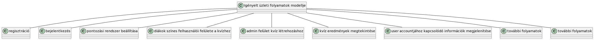

# Igényelt üzleti folyamatok modellje: 

A megrendelő a főoldalon akar bejelentkezni (felhasználónév és jelszó) és a regisztrálni, ami egy új oldalon folytatódik (felhasználónév, jelszó és e-mail cím megadásával). A bejelentkezés után az alkalmazás funkcióihoz hozzáférést kell biztosítani a felhasználók szerepkörétől függően. A feladatokat az adminisztrátor állítja össze, így ezeket részletekre kell bontani. Ezek közé tartozik a konkrét válaszokat várt kvíz, amely több választási lehetőséget kínál, beleértve az egy vagy több helyes választ is. Emellett rajzfeladatok is szerepelhetnek, és ezek kombinációi lehetnek egy feladatsorban.

